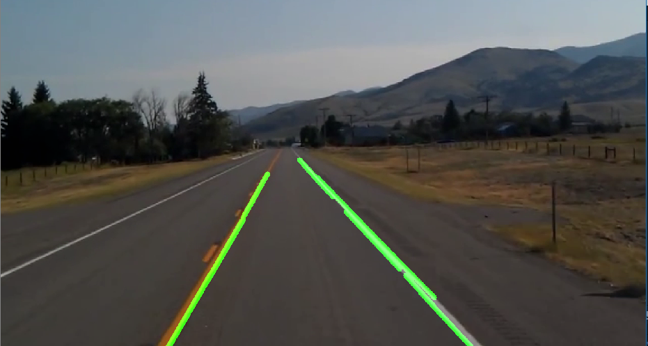

# Finding-Lanes
---

### Test image-
 

 

### Output image-

 

 

---
Dear Ma'am,                   I am writing this to inform you of my resignation from my current position as a data scientist at Guires Solution pvt ltd. I have thoroughly enjoyed working with the team and am grateful for the opportunities and experience that I have gained during my time here. After careful consideration and self-reflection, I have decided to pursue a new path which demands less of my time in work and lets me continue my college studies in parallel without any difficulties and mental stress. This is a significant decision for me, and while it is not an easy one. I believe it is the right step for me at this point in my career. Please accept my notice of resignation effective from March 4th, 2023. I understand that as per the mutually agreed terms and conditions at the time of appointment, the notice period will be of 60 days and therefore, I am writing this letter to request you to please request this duration from 60 days to 30 days.
I would also like to add that I am willing to cooperate for a smoother transition for the company and a replacement for me. I would like to take this opportunity to thank you and the entire team for your guidance, support and encouragement during this tenure here. Please let me know if there is anything else I can do to assist in the transition process.
Thank youYours sincerelySaikrishna R
### Requirements
* python 3.6 
* open cv
* matplotlib
